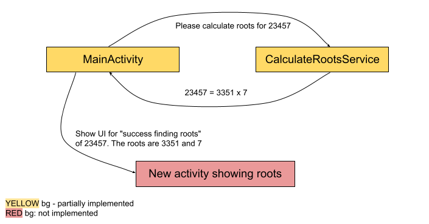

# Find Roots

An Android exercise for developers teaching how to play around with intents, activities, services and broadcast receivers

## To fulfill this exercise:

> take a loot at file `CalculateRootsService.java`

This service accepts an intent with a number to find roots for.
You should calculate the roots until either roots found, understood that the number is prime, or 20 seconds passed.
You should send a broadcast from this service.

> take a loot at file `MainActivity.java`

The MainActivity has UI to let the user input a number and start the service.
The **UI flow specs** are detailed in the file `MainActivity.java` and contain relevant specs for:
1. when to start find-roots calculation service
2. what to do when waiting for a result
3. handle different result broadcasts from the service

> take a look at file `AndroidManifest.xml`

The file `AndroidManifest.xml` holds definitions for all activities and services in your app.
Any class extending `Activity` or `Service` must be defined there, or else you can't use it in your app.
As part of handling "found roots" broadcast, the MainActivity needs to open a new activity to show "success!"
You will need to:
1. create a new layout xml file (you can copy `activity_main.xml` with a different name, or just create a simple file with a single TextView)
   This file will be used as the "success!" screen.
2. create a new class extending Activity (in Java/Kotlin), which will use the new layout xml file
3. add an <activity ...> tag in the `AndroidManifest.xml` so the new activity could be used in your app
4. When you will open this new activity from the MainActivity, pass the number and its root in the intent
If you're unsure how to do this, google search "android create new activity" and "android pass data to another activity". 

## Tests:

> take a loot at file `CalculateRootsServiceTest.java`

There is a single test there that validates good behavior of the `CalculateRootsService` when it needs to calculate roots for the input 15
Make sure you read and understand this test.
Run the test and make sure you it passes.

> take a loot at file `MainActivityTest.java`

There are some tests already written there.
Make sure you read and understand the existing tests.
Implement some more unit tests as defined in the TODOs.
Run the tests and make sure you they all pass.

## Remarks:

See the diagram:

In the bottom-left part of the screen there is a `TODO` tab. click it. You can see all the places where you should work :)

---

✨ Good luck! ✨